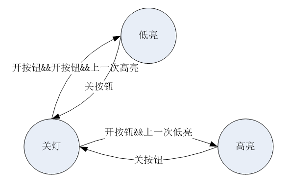

> 学习目的：掌握状态机模式的常见C语言实现 </br>
> 学习资料：</br>
> （1）https://bbs.huaweicloud.com/blogs/113179

# 状态机模式
## 状态转移矩阵
对于简单的有限状态机FSM来说，其最核心的部分是状态转移矩阵。比如灯泡在开关按钮作用下亮灭状态转换可以简单地实现如下。
```c
enum {
    LIGHT_STATE_OFF = 0,
    LIGHT_STATE_ON,
    LIGHT_STATE_BUTT
};

enum {
    EVENT_BTN_OFF = 0,
    EVENT_BTN_ON,
    EVENT_BTN_BUTT
};

static uint32_t g_stateTable[LIGHT_STATE_BUTT][EVENT_BTN_BUTT] = {
                     /* trun off */    /* trun on */
/* light off */    { LIGHT_STATE_OFF, LIGHT_STATE_ON },
/* light on  */    { LIGHT_STATE_OFF, LIGHT_STATE_ON }
};

uint32_t LightFsmEvent(uint32_t currState, uint32_t event)
{
    // if (currState >= LIGHT_STATE_BUTT || event >= EVENT_BTN_BUTT) {
    //     return RETURN_ERROR;
    // }

    return g_stateTable[currState][event];
}

int main()
{
    uint32_t index, newState;
    uint32_t state = LIGHT_STATE_OFF;
    uint32_t eventList[] = { EVENT_BTN_ON, EVENT_BTN_OFF, EVENT_BTN_ON };
    uint32_t size = sizeof(eventList) / sizeof(eventList[0]);

    for (index = 0; index < size; index++) {
        newState = LightFsmEvent(state, eventList[index]);
        printf("oldState:%u, event:%u, newState:%u\n", state, eventList[index], newState);
        state = newState;
    }

    return 0;
}
```

## 普通状态机模式实现
然而面对复杂一点的业务逻辑，上述的简单实现方法就不够用了，此时我们需要扩展。假如我们的灯第一次开的时候是高亮状态，关灯后再开是低亮，关灯后再开恢复成高亮状态。如此循环，状态转移如下图所示。




此时，处于关灯状态的灯泡还需要引入上一次开灯时的亮度才能决定开灯后亮度。这个时候我们可以扩展事件的处理逻辑并在处理逻辑中决定下一个状态。代码实现如下所示。
```c
enum {
    LIGHT_STATE_OFF,    // 灯灭
    LIGHT_STATE_LOW,    // 低亮度
    LIGHT_STATE_HIGH,   // 高亮度
    LIGHT_STATE_PEND,   // 未定义
    LIGHT_STATE_BUTT
};

enum {
    EVENT_BTN_OFF,      // 关灯
    EVENT_BTN_ON,       // 开灯
    EVENT_BTN_BUTT
};

// 记录上一次灯的亮度
static uint32_t g_lastState = LIGHT_STATE_LOW;

typedef struct tagLightFsm {
    uint32_t (*oper)(void *context);    // 事件处理函数
    uint32_t nextState;                 // 下一个状态
} LightFsm;

uint32_t FsmIgnore(void *context)
{
    printf("no state changed, ignore.\n");
    return 0;
}

uint32_t FsmButtonOn(void *context)
{
    uint32_t nextState;
    uint32_t lastState = *((uint32_t *)context);

    // 此次开灯后的亮度取决于上一次开灯后的亮度
    if (lastState == LIGHT_STATE_LOW) {
        nextState = LIGHT_STATE_HIGH;
    } else if (lastState == LIGHT_STATE_HIGH) {
        nextState = LIGHT_STATE_LOW;
    }

    // do something

    return nextState;
}

uint32_t FsmButtonOff(void *context)
{
    printf("light turned off.\n");
    return 0;
}

static LightFsm g_lightFsm[LIGHT_STATE_BUTT][EVENT_BTN_BUTT] = {
    // LIGHT_STATE_OFF
    { FsmIgnore, LIGHT_STATE_OFF },     // EVENT_BTN_OFF
    { FsmButtonOn, LIGHT_STATE_PEND },  // EVENT_BTN_ON
    // LIGHT_STATE_LOW
    { FsmButtonOff, LIGHT_STATE_OFF },  // EVENT_BTN_OFF
    { FsmIgnore, LIGHT_STATE_LOW },     // EVENT_BTN_ON
    // LIGHT_STATE_HIGH
    { FsmButtonOff, LIGHT_STATE_OFF },  // EVENT_BTN_OFF
    { FsmIgnore, LIGHT_STATE_HIGH }     // EVENT_BTN_ON
};

int32_t LightFsmEvent(uint32_t currState, uint32_t event)
{
    uint32_t nextState;
    uint32_t nextStateTmp;

    if (g_lightFsm[currState][event].nextState != LIGHT_STATE_PEND) {
        // 状态转换表中的下一步状态不为pend，说明下一步状态是确定的
        (void)g_lightFsm[currState][event].oper(&g_lastState);
        nextState = g_lightFsm[currState][event].nextState;
    } else {
        // 状态转换表中的下一步状态为pend，则实际下一步状态需要计算得到
        nextState = g_lightFsm[currState][event].oper(&g_lastState);
    }

    // 更新g_lastState
    if (nextState == LIGHT_STATE_HIGH || nextState == LIGHT_STATE_LOW) {
        g_lastState = nextState;
    }

    return 0;
}
```

上述代码核心的一点是引入了事件处理逻辑，并且支持下一个状态通过计算再给出。由于涉及到了上一次状态的变更，上述代码仍然不够清晰，还需要有更通用和抽象的实现方式以应对复杂的业务逻辑。总之，还有探索的空间
